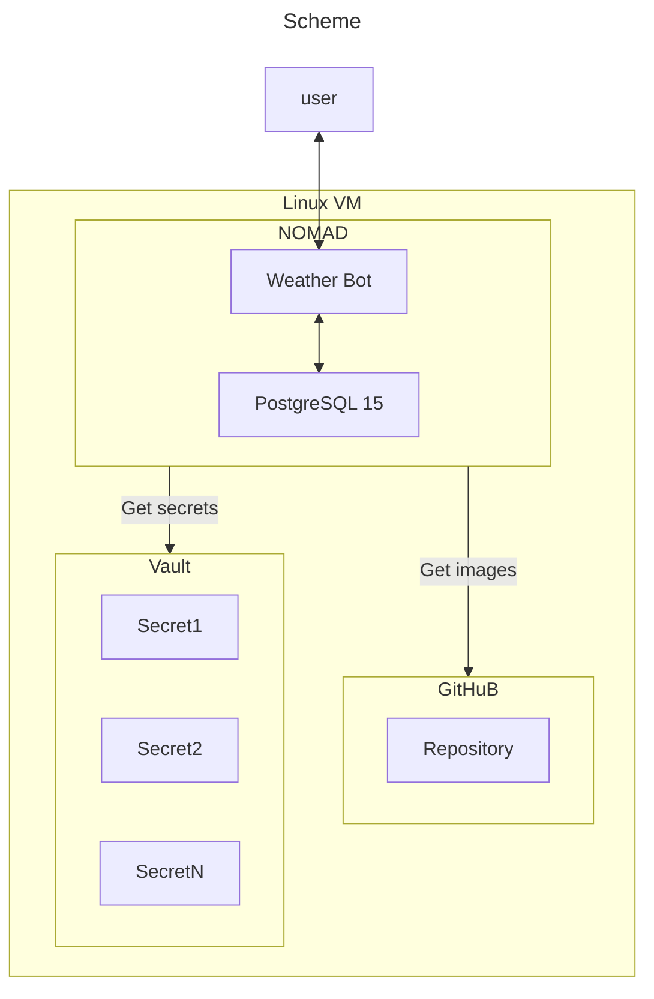

# Telegram Weather bot with CI/CD deploying pipline. 

## Description:
This repo contains Python code of telegram bot and CI/CD code for deployig in dev/prod environments:

## About App:
It is a python based app Telegram bot

## Features:

- **Free weather API** - bot uses free Open Weather API

- **Weather autosend function** - bot sends  Weather at desired time.


## Requrements: 
  - Linux based OS
  - Terraform >= 1.0
  - Docker
  - Anchore Grype tool 
  - HashiCorp Vault
  - HashiCorp Nomad
  - Github runner




```mermaid
flowchart TD;
  

```


## Directory structure:
1. k8s/ - contains manifests to deploy App and other services
2. Static/ - files for web page
3. templates/ - html templates for rendering web pages

## Main files:
1. Dockerfile - to build app
2. hello.py - app core
3. init_db.py - scirpt for migrating DB
4. Jenkinsfile.app - pipeline code for deploy app

## Quick start:
1. Deploy k8s cluster
2. Clone this repo
3. Customize your settings
4. Set context to current cluster
5. Go to k8s directory and run
    ```
    one_step_run.sh
    ```
6. Wait some time
7. Use http address which shows in terminal to access to App


## License
GNU GPL v3