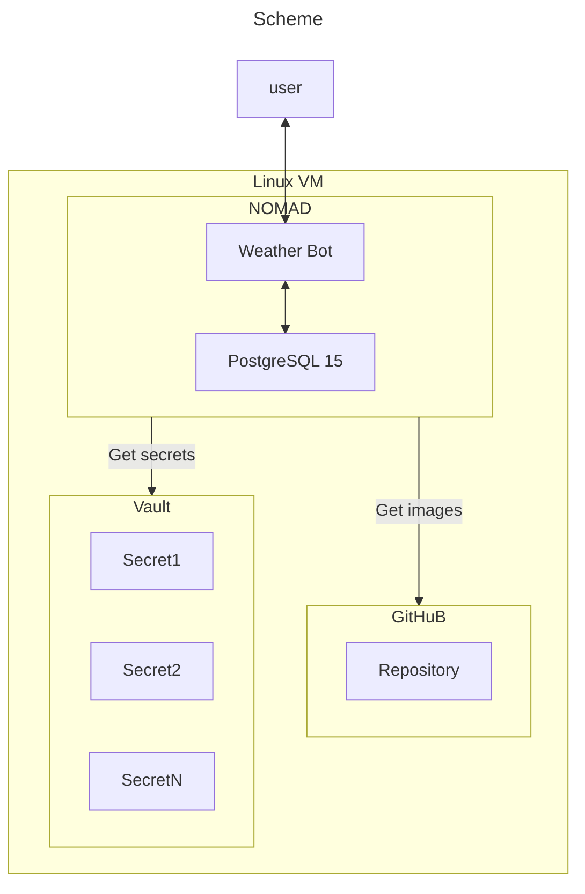
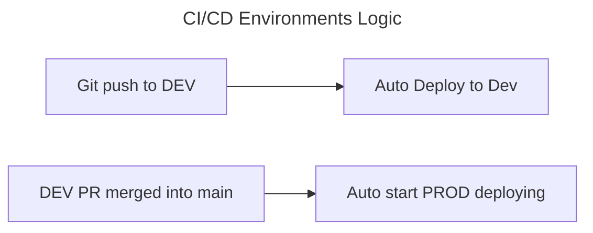
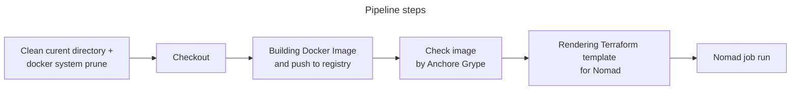

# Telegram Weather bot with CI/CD deploying pipline. 

## Description:
This repo contains Python code of telegram bot and CI/CD code for deployig in dev/prod environments:

## About App:
It is a python based app Telegram bot

## Features:

- **Free weather API** - bot uses free Open Weather API

- **Weather autosend function** - bot sends  Weather at desired time.

## Requrements: 
  - Linux based OS
  - Terraform >= 1.0
  - Docker
  - Anchore Grype tool 
  - HashiCorp Vault
  - HashiCorp Nomad
  - Github runner
  - poetry
  - Python > 3.7
  - pip

## Main files:
1. Dockerfile - to build app
2. main.py - app core
3. .github/ - CI/CD workflow
4. bot.tpl - terraform template
5. entrypoint.sh - entrypoint for container
6. main.tf - terraform main file
7. .pre-commit-config.yml - config for pre-commit tool
8. requiremenets.txt - python packages for app

## Quick start:
TBD

## Known bugs and limitations
1. Nomad can't understand when app container has been deployed succefully, CI/CD always shows last step as failed 
2. Hourly weather may show wrong hour.

## License
GNU GPL v3